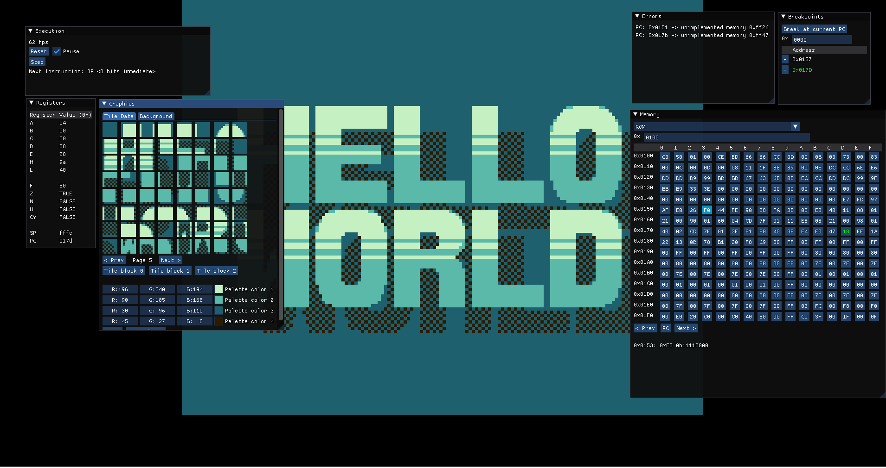

# Gameboy Emulator

## Run

```sh
cargo run -- [OPTIONS] <FILE>
```
```
Arguments
  <FILE>  Rom file path

Options:
        `--debug`
  `-h`, `--help`   Print help
```

## Todo

- [X] CPU
    - [X] Registers
    - [X] ALU
    - [X] Opcode execution
- [X] Interrupts
- [X] Timer
- [ ] Graphics
- [ ] Audio
- [ ] MBC
- [ ] Joypad input

<details>
<summary>Screenshots</summary>



</details>
