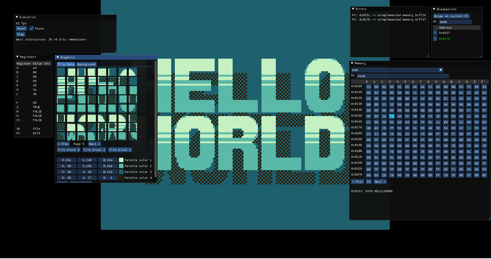
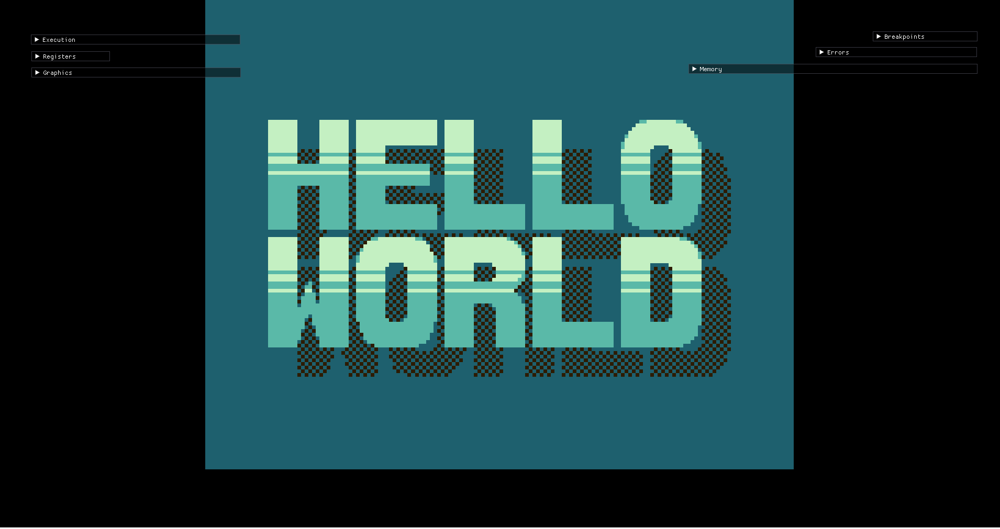

# Gameboy Emulator

A work-in-progress gameboy emulator written in Rust for learning purposes.
It also provides basic debugging tools to pause execution, step through instructions,
setting breakpoints and inspecting memory and CPU states

## Usage

```bash
./gameboy-emulator [OPTIONS] [FILE]
```
```
Arguments
  <FILE>  Rom file path

Options:
        `--debug`
  `-h`, `--help`   Print help
```

## Building

### Prerequisites

- CMake
- Dependencies to build SDL3 from source

### Run

```bash
git clone https://github.com/Pyr0de/gameboy-emulator
cd gameboy-emulator
```

```bash
cargo run --release -- [OPTIONS] <FILE>
```

## Todo

- [X] CPU
    - [X] Registers
    - [X] ALU
    - [X] Opcode execution
- [X] Interrupts
- [X] Timer
- [ ] Graphics
    - [X] Background
    - [ ] Window
    - [ ] OAM
- [ ] Audio
- [ ] MBC
- [ ] Joypad input

<details>
<summary>Screenshots</summary>




</details>

## References

- [gbdev.io](https://gbdev.io/)
- [Pan Docs](https://gbdev.io/pandocs/)
